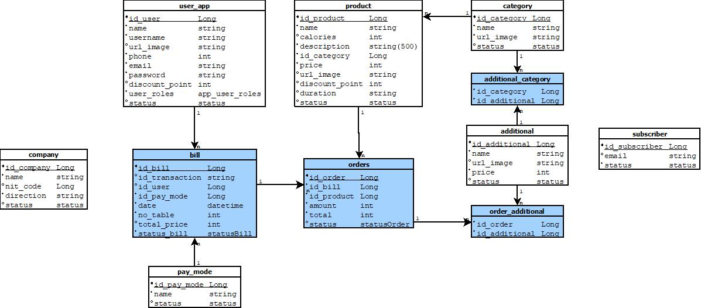

# FastFoodApp (Backend)
FoodApp application developed with Spring Boot and PostgreSQL. This is a REST API to serve as backend for different possible frontends (also been developed).
Currently it maps this DB schema:

## Author
Esteban Castaño: <castanoesteban9@gmail.com>
## Contributors:

Made with [contrib.rocks](https://contrib.rocks).
